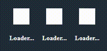
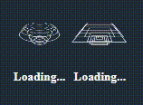
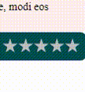
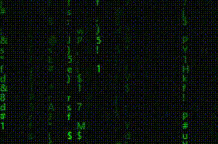

# Video lessons codes created with HTML, CSS, JS and SASS

[Youtube Chanel](https://www.youtube.com/AmurKhoyetsyan)

| Image                                                        | GitHub                                                                                                                                                                                                                        
|:------------------------------------------------------------:|:----------------------------------------------------------------------------------------------------------------------------------------------------------------------------------------------------------------------------:|
|      |[GitHub](https://github.com/AmurKhoyetsyan/Tutorial-HTML-CSS-JS-SASS/tree/master/JAVASCRIPT/Animated%20Circular%20Progress%20Bar%20With%20Number%20Counter)                                                                   |
|   |[GitHub](https://github.com/AmurKhoyetsyan/Tutorial-HTML-CSS-JS-SASS/tree/master/Animation/How%20to%20create%20a%20Camera%20Aanimation%20using%20pure%20HTML%20and%20CSS%2C%20CSS%20Effects)                                  |
|                 |[GitHub](https://github.com/AmurKhoyetsyan/Tutorial-HTML-CSS-JS-SASS/tree/master/JAVASCRIPT/How%20to%20create%203D%20Fox%20using%20pure%20HTML%2C%20CSS%2C%20JavaScript%2C%20CSS%203D%20Effect)                               |
|                   |[GitHub](https://github.com/AmurKhoyetsyan/Tutorial-HTML-CSS-JS-SASS/tree/master/JAVASCRIPT/How%20to%20make%20a%20clock%20using%20pure%20CSS%20and%20JS)                                                                      |
|                 |[GitHub](https://github.com/AmurKhoyetsyan/Tutorial-HTML-CSS-JS-SASS/tree/master/Loaders/How%20to%20create%20a%20loader%20using%20pure%20HTML%20and%20CSS%203D%20CSS%20Effects%20Version%20four)                              |
|                |[GitHub](https://github.com/AmurKhoyetsyan/Tutorial-HTML-CSS-JS-SASS/tree/master/Loaders/How%20to%20create%20a%20loader%20using%20pure%20HTML%20and%20CSS%203D%20CSS%20Effects%20Version%20ten)                               |
|                |[GitHub](https://github.com/AmurKhoyetsyan/Tutorial-HTML-CSS-JS-SASS/tree/master/Loaders/How%20to%20create%20a%20loader%20using%20pure%20HTML%20and%20CSS%20CSS%20Effects%20Version%20nine)                                   |
|                 |[GitHub](https://github.com/AmurKhoyetsyan/Tutorial-HTML-CSS-JS-SASS/tree/master/Loaders/How%20to%20create%20a%20loader%20using%20pure%20HTML%20and%20CSS%20Heart%20Spinner%20CSS%20Effects%20Version%20seven)                |
|                 |[GitHub](https://github.com/AmurKhoyetsyan/Tutorial-HTML-CSS-JS-SASS/tree/master/Loaders/How%20to%20create%20a%20loader%20using%20pure%20HTML%20and%20CSS%20Spinner%20CSS%20Effects%20Version%20five)                         |
|                 |[GitHub](https://github.com/AmurKhoyetsyan/Tutorial-HTML-CSS-JS-SASS/tree/master/Loaders/How%20to%20create%20a%20loader%20using%20pure%20HTML%20and%20CSS%20Spinner%20CSS%20Effects%20Version%20six)                          |
|                 |[GitHub](https://github.com/AmurKhoyetsyan/Tutorial-HTML-CSS-JS-SASS/tree/master/Loaders/How%20to%20create%20a%20loader%20using%20pure%20HTML%20and%20CSS%20Version%20one)                                                    |
|                 |[GitHub](https://github.com/AmurKhoyetsyan/Tutorial-HTML-CSS-JS-SASS/tree/master/Loaders/How%20to%20create%20a%20loader%20using%20pure%20HTML%20and%20CSS%20Version%20there)                                                  |
|                 |[GitHub](https://github.com/AmurKhoyetsyan/Tutorial-HTML-CSS-JS-SASS/tree/master/Loaders/How%20to%20create%20a%20loader%20using%20pure%20HTML%20and%20CSS%20Version%20two)                                                    |
|                 |[GitHub](https://github.com/AmurKhoyetsyan/Tutorial-HTML-CSS-JS-SASS/tree/master/Loaders/How%20to%20create%20a%20loader%20using%20pure%20HTML%20and%20CSS%2C%20Spinner%2C%20CSS%20Effects%2C%20Version%20eight)               |
|              |[GitHub](https://github.com/AmurKhoyetsyan/Tutorial-HTML-CSS-JS-SASS/tree/master/Loaders/How%20to%20create%20a%20Pac%20Man%20loader%20using%20pure%20HTML%20and%20CSS%2C%20Css%20Animation%2C%20Css%20Effects)                |
|                 |[GitHub](https://github.com/AmurKhoyetsyan/Tutorial-HTML-CSS-JS-SASS/tree/master/Loaders/How%20to%20create%20a%20potion%20loader%20using%20pure%20HTML%20and%20CSS%2C%20Css%20Animation%2C%20Css%20Effects)                   |
|                |[GitHub](https://github.com/AmurKhoyetsyan/Tutorial-HTML-CSS-JS-SASS/tree/master/Loaders/How%20to%20create%20an%20Around%20the%20Earth%20loader%20using%20pure%20HTML%20and%20CSS%2C%203D%20CSS%20Effects%2C%20CSS%20Animtion)|
|               |[GitHub](https://github.com/AmurKhoyetsyan/Tutorial-HTML-CSS-JS-SASS/tree/master/Switch/How%20to%20create%20switch%20toggle%20using%20pure%20HTML%20CSS%20Version%20One)                                                      |
|             |[GitHub](https://github.com/AmurKhoyetsyan/Tutorial-HTML-CSS-JS-SASS/tree/master/CSS%20Effects/Pure%20CSS%20Text%20Portrait%20Effects%20Html%20CSS%20Tutorial)                                                                |
|             |[GitHub](https://github.com/AmurKhoyetsyan/Tutorial-HTML-CSS-JS-SASS/tree/master/CSS%20Effects/How%20to%20create%20Rating%20Stars%20using%20pure%20HTML%20and%20CSS%2C%20CSS%20Effects)                                       |
|             |[GitHub](https://github.com/AmurKhoyetsyan/Tutorial-HTML-CSS-JS-SASS/tree/master/CSS%20Effects/Double%20Exposure%20Effects%20using%20Html%20%26%20CSS%20only%20%20CSS%20background-blend-mode)                                |
|             |[GitHub](https://github.com/AmurKhoyetsyan/Tutorial-HTML-CSS-JS-SASS/tree/master/JAVASCRIPT/How%20to%20create%20draggable%20file%20upload%20using%20pure%20HTML%2C%20CSS%20and%20JavaScript)                                  |
|   |[GitHub](https://github.com/AmurKhoyetsyan/Tutorial-HTML-CSS-JS-SASS/tree/master/JAVASCRIPT/How%20to%20create%20Traffic%20Light%20using%20pure%20HTML%20CSS%20JS)                                                             |
|  |[GitHub](https://github.com/AmurKhoyetsyan/Tutorial-HTML-CSS-JS-SASS/tree/master/Loaders/How%20to%20create%20a%20Ekvalayzer%20Loader%20using%20pure%20HTML%20CSS)                                                             |
|                |[GitHub](https://github.com/AmurKhoyetsyan/Tutorial-HTML-CSS-JS-SASS/tree/master/Loaders/How%20to%20create%20a%20loader%20using%20pure%20HTML%20and%20CSS%20CSS%20Effects%20Version%20eleven)                                 |
|                 |[GitHub](https://github.com/AmurKhoyetsyan/Tutorial-HTML-CSS-JS-SASS/tree/master/CSS%20Effects/How%20to%20Create%20An%20Image%20Slider%20in%20HTML%20and%20CSS%20Step%20by%20Step%20Image%20SlideShow%20using%20CSS3)         |
|       |[GitHub](https://github.com/AmurKhoyetsyan/Tutorial-HTML-CSS-JS-SASS/tree/master/Animation/How%20to%20create%20Animated%20Christmas%20Tree%20using%20pure%20HTML%20CSS)                                                       |
|        |[GitHub](https://github.com/AmurKhoyetsyan/Tutorial-HTML-CSS-JS-SASS/tree/master/Switch/How%20to%20create%20animated%20toogle%20using%20pure%20HTML%20CSS)                                                                    |
|            |[GitHub](https://github.com/AmurKhoyetsyan/Tutorial-HTML-CSS-JS-SASS/tree/master/JAVASCRIPT/How%20to%20create%20Matrix%20Effect%20using%20pure%20HTML%20CSS%20JAVASCRIPT)                                                     |
|                |[GitHub](https://github.com/AmurKhoyetsyan/Tutorial-HTML-CSS-JS-SASS/tree/master/Loaders/How%20to%20create%20a%20loader%20using%20pure%20HTML%20and%20CSS%20Hourglass%20Spinner%20CSS%20Effects%20Version%20twelve)           |
|              |[Github](https://github.com/AmurKhoyetsyan/Tutorial-HTML-CSS-JS-SASS/tree/master/Loaders/How%20to%20create%20a%20loader%20using%20pure%20HTML%20and%20CSS%20Rectangular%20ping%20CSS%20Effects%20Version%20thirteen)          |
|                |[Github](https://github.com/AmurKhoyetsyan/Tutorial-HTML-CSS-JS-SASS/tree/master/Loaders/How%20to%20create%20a%20loader%20using%20pure%20HTML%20and%20CSS%20Version%20fifteen)                                                |
|                |[Github](https://github.com/AmurKhoyetsyan/Tutorial-HTML-CSS-JS-SASS/tree/master/Loaders/How%20to%20create%20a%20loader%20using%20pure%20HTML%20and%20CSS%20Spinner%20CSS%20Effects%20Version%20seventeen)                    |
|                 |[Github](https://github.com/AmurKhoyetsyan/Tutorial-HTML-CSS-JS-SASS/tree/master/Loaders/How%20to%20create%20a%20loader%20using%20pure%20HTML%20and%20CSS%20Spinner%20CSS%20Effects%20Version%20seventeen)                    |
|                 |[Github](https://github.com/AmurKhoyetsyan/Tutorial-HTML-CSS-JS-SASS/tree/master/Loaders/How%20to%20create%20a%20loader%20using%20pure%20HTML%20and%20CSS%20Spinner%20CSS%20Effects%20Version%20seventeen)                    |